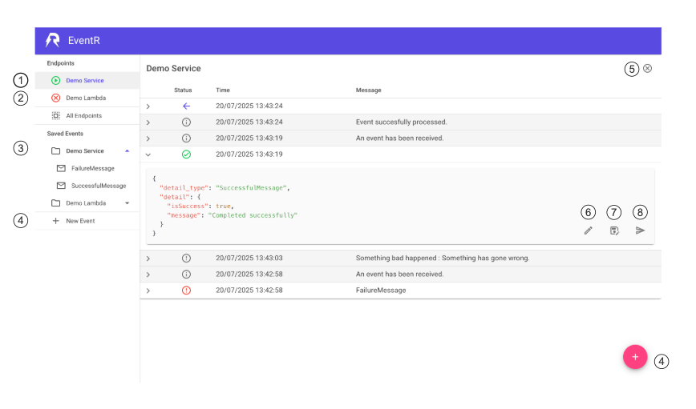
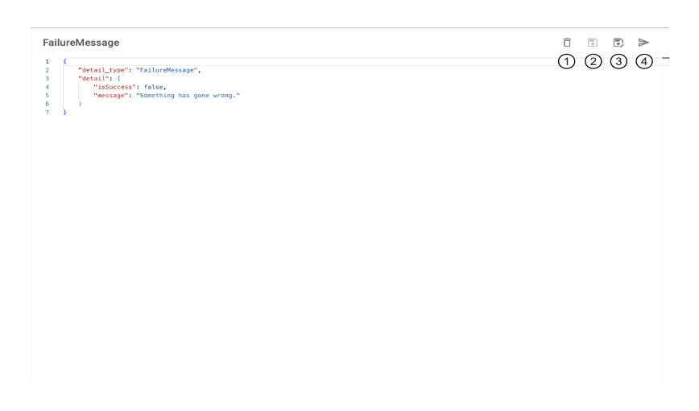

# Using The Debugger

## Event Monitor Page

### 1 - Endpoints (Active)

Active endpoints are currently running applications which have successfully connected to the debugger. Clicking on one shows the events and log messages pertaining to that application in the right hand portion of the screen.

### 2 - Endpoints (Inactive)

Inactive endpoints are applications which have previously connected to the debugger, but which have not interacted with the debugger for some time. These endpoints can still be clicked to view events and log messages previously sent, but new messages can't be sent to them.

### 3 - Saved Events

Each registered endpoint has a folder (by default .eventr) containing example events. Clicking on one opens the event editor, where they modifed, saved or sent to an active endpoint. The saved event folder is usually located at the project root of the running application, allowing them to be checked in and shared.

### 4 - New Event

Opens an empty event editor page.

### 5 - Clear Events

Clears all events from the event viewer.

### 6 - Edit Event

Opens the current event in the event editor.

### 7 - Save Event

Saves the event into the Saved Event folder of one of the endpoints.

### 8 - Send Event

Sends the event to one of the endpoints for processing.

## Event Editor Page

### 1 - Delete Event

Deletes the saved event.

### 2 - Save Event

Saves changes to the edited event.

### 3 - Save Event As

Saves the event to a different endpoint's event folder, or with a different filename.

### 4 - Send Event

Sends the event to one of the endpoints for processing.
